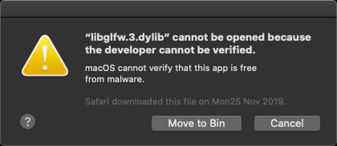
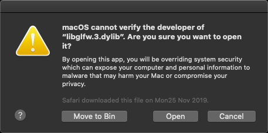
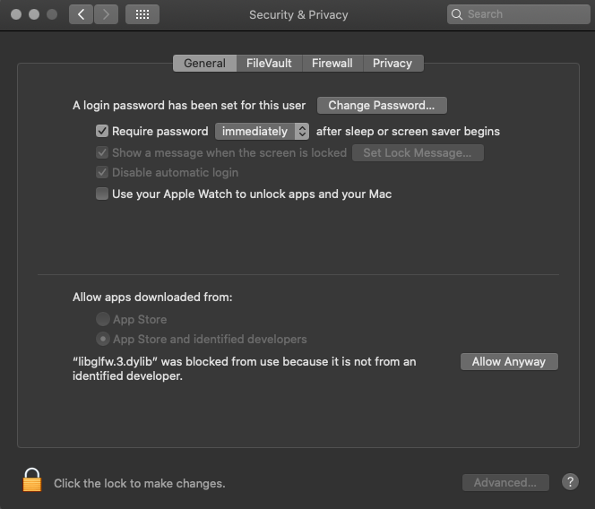

# Mac installation

## Overview
Neutrino is a C++ library that facilitates writing parallel code running on GPU hardware combining the power of the OpenCL computational framework with the OpenGL graphics language (see https://www.neutrino.codes).

Neutrino can be successfully installed and used on Mac in two different ways. The first method is more manual. The second one suggests the use of the **VScode** editor, because this exists in all three operating systems and it works in combination of their corresponding native C/C++ environments. This provides a universal toolchain that gives advantages when working from different types of machines.

## Hardware requirements:
- **OpenCL-OpenGL interoperability GPU mode**. Use the command line tool `clinfo` (see *Software requirements*) to check for the availability of this mode. On a terminal do:\
`clinfo`\
\
In the text output (it can be long!) there should be a section regarding your GPU similar to this one:\
...\
`Device Name                                     HD Graphics 5000`\
`Device Vendor                                   Intel`\
`Device Vendor ID                                0x1024500`\
`Device Version                                  OpenCL 1.2`\
`Driver Version                                  1.2(May 26 2020 20:53:48)`\
`Device OpenCL C Version                         OpenCL C 1.2`\
`Device Type                                     GPU`\
`Device Profile                                  FULL_PROFILE`\
...\
`Device Extensions                               cl_APPLE_SetMemObjectDestructor cl_APPLE_ContextLoggingFunctions cl_APPLE_clut cl_APPLE_query_kernel_names cl_APPLE_gl_sharing cl_khr_gl_event cl_khr_global_int32_base_atomics cl_khr_global_int32_extended_atomics cl_khr_local_int32_base_atomics cl_khr_local_int32_extended_atomics cl_khr_byte_addressable_store cl_khr_image2d_from_buffer cl_khr_gl_depth_images cl_khr_depth_images cl_khr_3d_image_writes`\
...\
\
and verify the presence of the `cl_APPLE_gl_sharing` extension.

## Software requirements:
- Clinfo (https://github.com/Oblomov/clinfo)
- OpenCL (runtime/loader + headers), coming along the OS-X installation.
- OpenGL (library + headers), coming along the OS-X installation.
- GIT (https://git-scm.com)
- GLAD (https://glad.dav1d.de/) *
- GLFW (https://www.glfw.org/) **
- GMSH (https://gmsh.info/)
- CLANG (https://clang.llvm.org/) ***
- CMake (https://cmake.org) ***
- GraphViz (https://graphviz.org/)
- Doxygen (https://www.doxygen.nl/)

Under Mac, it should be possible to install most of those packages via the **Homebrew** (https://brew.sh/) package manager.

\* The GLAD loader should be generated from its webpage using the following settings:
- Language = C/C++
- gl = Version 4.6 (or greater)
- Profile = Core

After having generated it, download the zip file containing the code and extract it in a custom directory (see *Installation*).

\** It might be possible that OS-X will not recognize GLFW as a valid software, throwing an error similar to this one:

or this one:

In that case, you should enable it from the Mac OS-X *Security & Privacy* panel:

\*** When using the **VScode editor**, please follow the instructions (https://code.visualstudio.com/docs/cpp/config-linux) in order to install it and verify the installation of CLANG, as well as the instructions (https://code.visualstudio.com/docs/cpp/cmake-linux) to verify the installation of Cmake and to install the Cmake Tools extension for VSCode.

## Installation: 1st method (manual compilation)
From a system command shell, navigate into your favourite directory and clone the Neutrino project using the command git clone https://github.com/NeutrinoCodes/neutrino.git.

Into the Neutrino's project directory, create a configuration script file called `configure` and edit it by adding the following command lines:\
`cmake -B"./cmake" -H"./" \`\
`-DGLAD_PATH=your_path_to_glad \`\
`-DGLFW_PATH=your_path_to_glfw \`\
`-DNEUTRINO_PATH=your_path_to_neutrino \`\
`-DCMAKE_C_COMPILER=your_path_to_C_compiler \`\
`-DCMAKE_CXX_COMPILER=your_path_to_C++_compiler \`\
`-DCMAKE_INSTALL_RPATH_USE_LINK_PATH="ON"`\
\
and specify the paths accordingly, where:

*GLAD_PATH* is the path of the root directory of the Glad library: it contains the subdirectories src and include;

*GLFW_PATH* is the path where glfw3.h is located;

*NEUTRINO_PATH* is the path of Neutrino's project folder and should be followed by /libnu, where the library will be installed;

*CMAKE_C_COMPILER* is the path of your C compiler (e.g. Xcode);

*CMAKE_CXX_COMPILER* is the path of your C++ compiler (e.g. Xcode).

Make the configuration script executable (`chmod a+x configure`) and launch it by typing `./configure` at the command prompt. The CMake configuration files will be generated.

Enter the cmake directory and type `make install` (use `make clean` to remove old build files if necessary).

## Installation: 2nd method (VScode toolchain compilation)
In this method we assume Neutrino is going to be installed in a directory named *NeutrinoCodes* containing the following subdirectories:
- glad
- glfw
- gmsh

where the corresponding software, according to the software requirements in this guide, has been already installed.

1. From the command shell (either VScode's or system's), navigate into *NeutrinoCodes* and create a `libnu` directory using the command:\
`mkdir libnu`\
\
This will create the `libnu` directory.

2. From the command shell (either VScode's or system's), navigate into *NeutrinoCodes* and clone the Neutrino project using the command:\
`git clone https://github.com/NeutrinoCodes/neutrino.git` \
\
This will create the `neutrino` directory.

3. Go to the `neutrino` directory and create a `.vscode` hidden directory:\
`mkdir .vscode`\
\
and create a new file `settings.json` in it, then fill it with the following information:\
`{`\
&nbsp;&nbsp;`"C_Cpp.default.configurationProvider": "vector-of-bool.cmake-tools",`\
&nbsp;&nbsp;`"cmake.configureArgs" : [   `\
&nbsp;&nbsp;&nbsp;&nbsp;`"-DGLAD_PATH=your_path_to_NeutrinoCodes/glad,`\
&nbsp;&nbsp;&nbsp;&nbsp;`"-DGLFW_PATH=your_path_to_NeutrinoCodes/glfw",`\
&nbsp;&nbsp;&nbsp;&nbsp;`"-DGMSH_PATH=your_path_to_NeutrinoCodes/gmsh",`\
&nbsp;&nbsp;&nbsp;&nbsp;`"-DNEUTRINO_PATH=your_path_to_NeutrinoCodes/libnu"`\
&nbsp;&nbsp;`]`\
`}`\
\
and save it.\
\
At this point, Neutrino is configured for your system. 

4. In VScode, go to the left bar and locate the **CMake** button (it comes after the installation of the CMake Tools extension for VScode) and push it: a CMake panel will open, push the **Configure All Projects** button on it.

5. In VScode, go to the bottom bar and locate the **Target** button: verify it has been selected to **[install]**.

6. In VScode, go to the bottom bar and locate the **Build** button: push it in order to build the Neutrino project.\
\
At this point the NeutrinoCodes directory should appear like this:
- glad
- glfw
- gmsh
- libnu
- neutrino

7. We all like tidy code! For this, we provide an **Uncrustify** (sources: https://github.com/uncrustify/uncrustify) configuration file specific for Neutrino. In order to use it, please first install Uncrustify according to your operating system (e.g. use Homebrew under Mac), then install the VScode's *Uncrustify extension* (https://marketplace.visualstudio.com/items?itemName=LaurentTreguier.uncrustify).\
\
Add the following lines to either the *global* or *project* **settings.json** file:
`"uncrustify.executablePath.osx": "your_path_to_uncrustify",`\
`"editor.defaultFormatter": "LaurentTreguier.uncrustify",`\
`"editor.formatOnSave": true`\
\
To edit the *global* settings, on VScode go to the left bar: push the **Extensions** button and select the Uncrustify extension. Then go to **Manage --> Extension Settings** (gear-like icon) and edit the `settings.json` file by clicking one of the links in that section. This will set the Uncrustify code formatter globally in all your VScode projects (but still with per-project custom uncrustify configuration files).\
\
To edit the *project* settings, open `settings.json` file in the `.vscode` you created for Neutrino (the hidden directory inside the `Neutrino` directory) and put the same lines in it. This will set Uncrustify as code formatter (together with the configuration file we provide) only for the Neutrino project.

Congratulations, you have installed Neutrino on Mac!