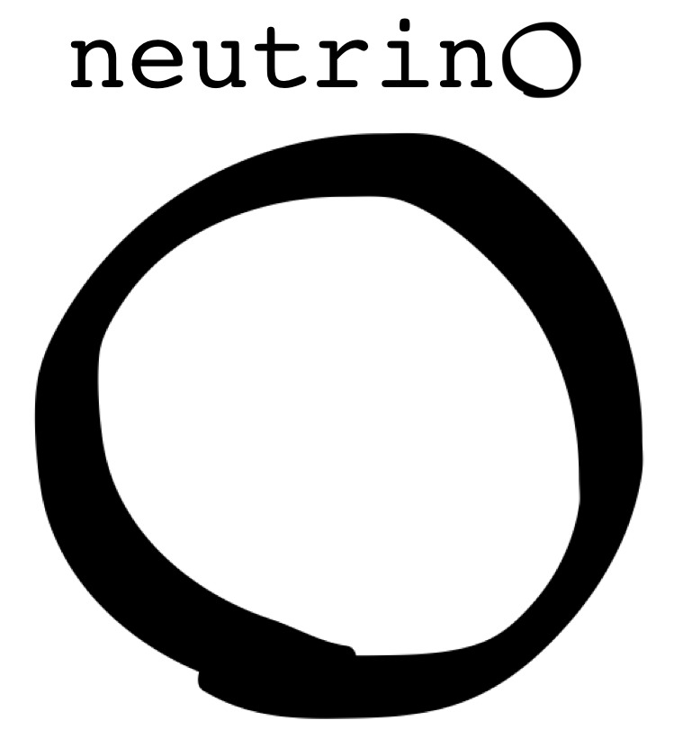
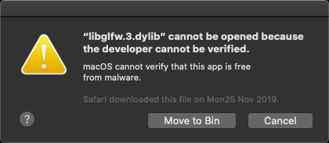
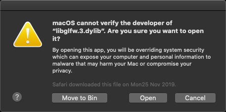
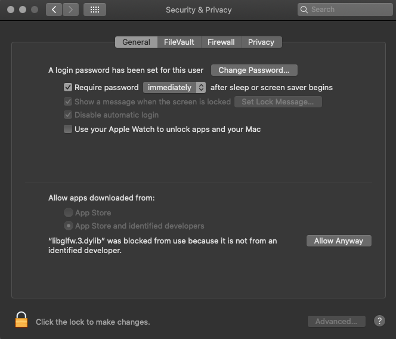

# NEUTRINO LIBRARY

*A fast and light library for GPU-based computation and interactive data visualization.*

[www.neutrino.codes](http://www.neutrino.codes)

© Alessandro LUCANTONIO, Erik ZORZIN - 2018-2020

# Overview
Neutrino can be successfully installed and used on Linux, Mac or Windows. The recommended installation suggests the use of the **VScode** editor, because this exists in all three operating systems and it works in combination of their corresponding native C/C++ environments. This provides a universal toolchain that gives advantages when working from different types of machines. The installation of Neutrino, along this toolchain, is only sligthly different according to the underlying operating system.

# Linux 

## Hardware requirements:
- **OpenCL-OpenGL interoperability GPU mode**. Use the command line tool `clinfo` (see *Software requirements*) to check for the availability of this mode. On a terminal do:\
`clinfo`\
\
In the text output (it can be long!) there should be a section regarding your GPU similar to this one:\
...\
`Name:                                          GeForce GTX 1060 6GB`\
`Vendor:                                        NVIDIA Corporation`\
`Driver version:                                451.67`\
`Profile:                                       FULL_PROFILE`\
`Version:                                       OpenCL 1.2 CUDA`\
`Extensions:                                    cl_khr_global_int32_base_atomics cl_khr_global_int32_extended_atomics cl_khr_local_int32_base_atomics cl_khr_local_int32_extended_atomics cl_khr_fp64 cl_khr_byte_addressable_store cl_khr_icd cl_khr_gl_sharing cl_nv_compiler_options cl_nv_device_attribute_query cl_nv_pragma_unroll cl_nv_d3d10_sharing cl_khr_d3d10_sharing cl_nv_d3d11_sharing cl_nv_copy_opts cl_nv_create_buffer cl_khr_int64_base_atomics cl_khr_int64_extended_atomics`\
...\
\
and verify the presence of the `cl_khr_gl_sharing` extension.

## Software requirements:

- Clinfo (https://github.com/Oblomov/clinfo)
- OpenCL (runtime/loader + headers), coming along the installation of the graphics drivers
- OpenGL (library + headers), coming along the installation of the graphics drivers
- GIT (https://git-scm.com)
- GLAD (https://glad.dav1d.de/) *
- GLFW (https://www.glfw.org/)
- GMSH (https://gmsh.info/)
- GCC (https://gcc.gnu.org) **
- CMake (https://cmake.org) **
- GraphViz (https://graphviz.org/)
- Doxygen (http://www.doxygen.nl/)

Under Linux, it should be possible to install most of those packages via the system's package manager.

\* The GLAD loader should be generated from its webpage using the following settings:
- Language = C/C++
- gl = Version 4.6 (or greater)
- Profile = Core

After having generated it, download the zip file containing the code and extract it in a custom directory (see *Installation*).

\** It is recommended to use the **VScode editor** and follow the instructions (https://code.visualstudio.com/docs/cpp/config-linux) in order to install it and verify the installation of GCC, as well as the instructions (https://code.visualstudio.com/docs/cpp/cmake-linux) to verify the installation of Cmake and to install the Cmake Tools extension for VSCode.

## Installation:
The recommended method is by using the VScode toolchain hereby described. We assume Neutrino is going to be installed in a directory named *NeutrinoCodes* containing the following subdirectories:
- glad
- glfw
- gmsh

where the corresponding software, according to the software requirements in this guide, has been already installed.

1. From the command shell (either VScode's or system's), navigate into *NeutrinoCodes* and create a `libnu` directory using the command:\
`mkdir libnu`\
\
This will create the `libnu` directory.

2. From the command shell (either VScode's or system's), navigate into *NeutrinoCodes* and clone the Neutrino project using the command:\
`git clone https://github.com/NeutrinoCodes/neutrino.git` \
\
This will create the `neutrino` directory.

3. Go to the `neutrino` directory and create a `.vscode` hidden directory:\
`mkdir .vscode`\
\
and create a new file `settings.json` in it, then fill it with the following information:\
`{`\
&nbsp;&nbsp;`"C_Cpp.default.configurationProvider": "vector-of-bool.cmake-tools",`\
&nbsp;&nbsp;`"cmake.configureArgs" : [   `\
&nbsp;&nbsp;&nbsp;&nbsp;`"-DGLAD_PATH=your_path_to_NeutrinoCodes/glad,`\
&nbsp;&nbsp;&nbsp;&nbsp;`"-DGLFW_PATH=your_path_to_NeutrinoCodes/glfw",`\
&nbsp;&nbsp;&nbsp;&nbsp;`"-DGMSH_PATH=your_path_to_NeutrinoCodes/gmsh",`\
&nbsp;&nbsp;&nbsp;&nbsp;`"-DNEUTRINO_PATH=your_path_to_NeutrinoCodes/libnu"`\
&nbsp;&nbsp;`]`\
`}`\
\
and save it.\
\
At this point, Neutrino is configured for your system. 

4. In VScode, go to the left bar and locate the **CMake** button (it comes after the installation of the CMake Tools extension for VScode) and push it: a CMake panel will open, push the **Configure All Projects** button on it.

5. In VScode, go to the bottom bar and locate the **Target** button: verify it has been selected to **[install]**.

6. In VScode, go to the bottom bar and locate the **Build** button: push it in order to build the Neutrino project.\
\
At this point the NeutrinoCodes directory should appear like this:
- glad
- glfw
- gmsh
- libnu
- neutrino

Congratulations, you have installed Neutrino on Linux!

# Mac 

## Hardware requirements:
- **OpenCL-OpenGL interoperability GPU mode**. Use the command line tool `clinfo` (see *Software requirements*) to check for the availability of this mode. On a terminal do:\
`clinfo`\
\
In the text output (it can be long!) there should be a section regarding your GPU similar to this one:\
...\
`Device Name                                     HD Graphics 5000`\
`Device Vendor                                   Intel`\
`Device Vendor ID                                0x1024500`\
`Device Version                                  OpenCL 1.2`\
`Driver Version                                  1.2(May 26 2020 20:53:48)`\
`Device OpenCL C Version                         OpenCL C 1.2`\
`Device Type                                     GPU`\
`Device Profile                                  FULL_PROFILE`\
...\
`Device Extensions                               cl_APPLE_SetMemObjectDestructor cl_APPLE_ContextLoggingFunctions cl_APPLE_clut cl_APPLE_query_kernel_names cl_APPLE_gl_sharing cl_khr_gl_event cl_khr_global_int32_base_atomics cl_khr_global_int32_extended_atomics cl_khr_local_int32_base_atomics cl_khr_local_int32_extended_atomics cl_khr_byte_addressable_store cl_khr_image2d_from_buffer cl_khr_gl_depth_images cl_khr_depth_images cl_khr_3d_image_writes`\
...\
\
and verify the presence of the `cl_APPLE_gl_sharing` extension.

## Software requirements:

- Clinfo (https://github.com/Oblomov/clinfo)
- OpenCL (runtime/loader + headers), coming along the OS-X installation.
- OpenGL (library + headers), coming along the OS-X installation.
- GIT (https://git-scm.com)
- GLAD (https://glad.dav1d.de/) *
- GLFW (https://www.glfw.org/) **
- GMSH (https://gmsh.info/)
- CLANG (https://clang.llvm.org/) ***
- CMake (https://cmake.org) ***
- GraphViz (https://graphviz.org/)
- Doxygen (http://www.doxygen.nl/)

Under Mac, it should be possible to install most of those packages via the **Homebrew** (https://brew.sh/) package manager.

\* The GLAD loader should be generated from its webpage using the following settings:
- Language = C/C++
- gl = Version 4.6 (or greater)
- Profile = Core

After having generated it, download the zip file containing the code and extract it in a custom directory (see *Installation*).

\** It might be possible that OS-X will not recognize GLFW as a valid software, throwing an error similar to this one:

or this one:

In that case, you should enable it from the Mac OS-X *Security & Privacy* panel:

\*** It is recommended to use the **VScode editor** and follow the instructions (https://code.visualstudio.com/docs/cpp/config-clang-macx) in order to install it and verify the installation of GCC, as well as the instructions (https://code.visualstudio.com/docs/cpp/cmake-linux, instructions for Linux but good also for Mac) to verify the installation of Cmake and to install the Cmake Tools extension for VSCode.

## Installation:
The recommended method is by using the VScode toolchain hereby described. We assume Neutrino is going to be installed in a directory named *NeutrinoCodes* containing the following subdirectories:
- glad
- glfw
- gmsh

where the corresponding software, according to the software requirements for Linux in this guide, has been already installed.

1. From the command shell (either VScode's or system's), navigate into *NeutrinoCodes* and create a `libnu` directory using the command:\
`mkdir libnu`\
\
This will create the `libnu` directory.

2. From the command shell (either VScode's or system's), navigate into *NeutrinoCodes* and clone the Neutrino project using the command:\
`git clone https://github.com/NeutrinoCodes/neutrino.git` \
\
This will create the `neutrino` directory.

3. Go to the `neutrino` directory and create a `.vscode` hidden directory:\
`mkdir .vscode`\
\
and create a new file `settings.json` in it, then fill it with the following information:\
`{`\
&nbsp;&nbsp;`"C_Cpp.default.configurationProvider": "vector-of-bool.cmake-tools",`\
&nbsp;&nbsp;`"cmake.configureArgs" : [   `\
&nbsp;&nbsp;&nbsp;&nbsp;`"-DGLAD_PATH=your_path_to_NeutrinoCodes/glad,`\
&nbsp;&nbsp;&nbsp;&nbsp;`"-DGLFW_PATH=your_path_to_NeutrinoCodes/glfw",`\
&nbsp;&nbsp;&nbsp;&nbsp;`"-DGMSH_PATH=your_path_to_NeutrinoCodes/gmsh",`\
&nbsp;&nbsp;&nbsp;&nbsp;`"-DNEUTRINO_PATH=your_path_to_NeutrinoCodes/libnu"`\
&nbsp;&nbsp;`]`\
`}`\
\
and save it.\
\
At this point, Neutrino is configured for your system. 

4. In VScode, go to the left bar and locate the **CMake** button (it comes after the installation of the CMake Tools extension for VScode) and push it: a CMake panel will open, push the **Configure All Projects** button on it.

5. In VScode, go to the bottom bar and locate the **Target** button: verify it has been selected to **[install]**.

6. In VScode, go to the bottom bar and locate the **Build** button: push it in order to build the Neutrino project.\
\
At this point the NeutrinoCodes directory should appear like this:
- glad
- glfw
- gmsh
- libnu
- neutrino

Congratulations, you have installed Neutrino on Mac!

# Windows

## Hardware requirements:
- **OpenCL-OpenGL interoperability GPU mode**. Use the command line tool `clinfo` (see *Software requirements*) to check for the availability of this mode. On a terminal do:\
`clinfo`\
\
In the text output (it can be long!) there should be a section regarding your GPU similar to this one:\
...\
`Name:                                          GeForce GTX 1060 6GB`\
`Vendor:                                        NVIDIA Corporation`\
`Driver version:                                451.67`\
`Profile:                                       FULL_PROFILE`\
`Version:                                       OpenCL 1.2 CUDA`\
`Extensions:                                    cl_khr_global_int32_base_atomics cl_khr_global_int32_extended_atomics cl_khr_local_int32_base_atomics cl_khr_local_int32_extended_atomics cl_khr_fp64 cl_khr_byte_addressable_store cl_khr_icd cl_khr_gl_sharing cl_nv_compiler_options cl_nv_device_attribute_query cl_nv_pragma_unroll cl_nv_d3d10_sharing cl_khr_d3d10_sharing cl_nv_d3d11_sharing cl_nv_copy_opts cl_nv_create_buffer cl_khr_int64_base_atomics cl_khr_int64_extended_atomics`\
...\
\
and verify the presence of the `cl_khr_gl_sharing` extension.

## Software requirements:

- Clinfo (https://github.com/Oblomov/clinfo)
- OpenCL (runtime/loader + headers),  comining along the installation of the graphics drivers
- OpenGL (library + headers), coming along the installation of the graphics drivers.
- GIT (https://git-scm.com)
- GLAD (https://glad.dav1d.de/) *
- GLFW (https://www.glfw.org/)
- GMSH (https://gmsh.info/)
- GCC (https://gcc.gnu.org) **
- CMake (https://cmake.org) **
- GraphViz (https://graphviz.org/)
- Doxygen (http://www.doxygen.nl/)

\* The GLAD loader should be generated from its webpage using the following settings:
- Language = C/C++
- gl = Version 4.6 (or greater)
- Profile = Core

After having generated it, download the zip file containing the code and extract it in a custom directory (see *Installation*).

\** It is recommended to use the **VScode editor** and follow the instructions (https://code.visualstudio.com/docs/cpp/config-linux) in order to install it and verify the installation of GCC, as well as the instructions (https://code.visualstudio.com/docs/cpp/cmake-linux) to verify the installation of Cmake and to install the Cmake Tools extension for VSCode.

## Installation:
The recommended method is by using the VScode toolchain hereby described. We assume Neutrino is going to be installed in a directory named *NeutrinoCodes* containing the following subdirectories:
- glad
- glfw
- gmsh

where the corresponding software, according to the software requirements for Linux in this guide, has been already installed.

**IMPORTANT NOTE FOR GMSH INSTALLATION ON WINDOWS**: GMSH is used in Neutrino as an API library. Under a Windows purely native environment (which is the case of Windows + the Visual Studio compiler) there is a limitation (see https://gitlab.onelab.info/gmsh/gmsh/-/issues/894) and because of this the GMSH API can used only as an external DLL. In order to install it on Windows, please download the GMSH's *Software Development Kit (SDK) for Windows* (64-bit or 32-bit, according to your operating system) and follow this procedure:
- after having downloaded the GMSH's SDK `.zip` file, extract it and copy the `gmsh` directory into the `NeutrinoCodes` directory.
- go to the `include` directory in the `gmsh` directory and rename the `gmsh.h` file `gmsh.h_original`.
- in the same directory, rename the `gmsh.h_cwrap` file to `gmsh.h`.
- go to the `lib` directory in the `gmsh` directory and copy che GMSH DLL file into `C.\Windows\System32`.

This should make the GMSH's API working on Windows.

Continuing with the installation of Neutrino:

1. From the command shell (either VScode's or system's), navigate into *NeutrinoCodes* and create a `libnu` directory using the command:\
`mkdir libnu`\
\
This will create the `libnu` directory.

2. From the command shell (either VScode's or system's), navigate into *NeutrinoCodes* and clone the Neutrino project using the command:\
`git clone https://github.com/NeutrinoCodes/neutrino.git` \
\
This will create the `neutrino` directory.

3. Go to the `neutrino` directory and create a `.vscode` hidden directory:\
`mkdir .vscode`\
\
and create a new file `settings.json` in it, then fill it with the following information:\
`{`\
&nbsp;&nbsp;`"C_Cpp.default.configurationProvider": "vector-of-bool.cmake-tools",`\
&nbsp;&nbsp;`"cmake.configureArgs" : [   `\
&nbsp;&nbsp;&nbsp;&nbsp;`"-DGLAD_PATH=your_path_to_NeutrinoCodes\\glad,`\
&nbsp;&nbsp;&nbsp;&nbsp;`"-DGLFW_PATH=your_path_to_NeutrinoCodes\\glfw",`\
&nbsp;&nbsp;&nbsp;&nbsp;`"-DGMSH_PATH=your_path_to_NeutrinoCodes\\gmsh",`\
&nbsp;&nbsp;&nbsp;&nbsp;`"-DCL_PATH=your_path_to_OpenCL",`\
&nbsp;&nbsp;&nbsp;&nbsp;`"-DNEUTRINO_PATH=your_path_to_NeutrinoCodes\\libnu"`\
&nbsp;&nbsp;`]`\
`}`\
\
and save it.\
\
Notice all paths **must** be specificed with *double backslashes*, in order to correctly manage the possibility of space characters in the them.
Also notice that `your_path_to_OpenCL` might be something like this (it depends on your GPU's graphics drivers):\
`C:\\Program Files\\NVIDIA GPU Computing Toolkit\\CUDA\\v10.1`\
\
At this point, Neutrino is configured for your system. 

4. In VScode, go to the left bar and locate the **CMake** button (it comes after the installation of the CMake Tools extension for VScode) and push it: a CMake panel will open, push the **Configure All Projects** button on it.

5. In VScode, go to the bottom bar and locate the **Target** button: verify it has been selected to **[install]**.

6. In VScode, go to the bottom bar and locate the **Build** button: push it in order to build the Neutrino project.\
\
At this point the NeutrinoCodes directory should appear like this:
- glad
- glfw
- gmsh
- libnu
- neutrino

Congratulations, you have installed Neutrino on Windows!

# Post installation (recommended)

## Uncrustify:
We all like tidy code! For this, we provide an **Uncrustify** (sources: https://github.com/uncrustify/uncrustify) configuration file specific for Neutrino. In order to use it, please first install Uncrustify according to your operating system (e.g. use the Linux's package manager, or Homebrew under Mac or use these binaries: https://sourceforge.net/projects/uncrustify/ under Windows), then install the VScode's *Uncrustify extension* (https://marketplace.visualstudio.com/items?itemName=LaurentTreguier.uncrustify).

According to your operating system, add the following lines to either the *global* or *project* **settings.json** file:

### Linux:
`"uncrustify.executablePath.linux": "your_path_to_uncrustify",`\
`"editor.defaultFormatter": "LaurentTreguier.uncrustify",`\
`"editor.formatOnSave": true`

### Mac:
`"uncrustify.executablePath.osx": "your_path_to_uncrustify",`\
`"editor.defaultFormatter": "LaurentTreguier.uncrustify",`\
`"editor.formatOnSave": true`

### Windows:
`"uncrustify.executablePath.windows": "your_path_to_uncrustify.exe",`\
`"editor.defaultFormatter": "LaurentTreguier.uncrustify",`\
`"editor.formatOnSave": true`\

To edit the *global* settings, on VScode go to the left bar: push the **Extensions** button and select the Uncrustify extension. Then go to **Manage --> Extension Settings** (gear-like icon) and edit the `settings.json` file by clicking one of the links in that section. This will set the Uncrustify code formatter globally in all your VScode projects (but still with per-project custom uncrustify configuration files).

To edit the *project* settings, open `settings.json` file in the `.vscode` you created for Neutrino (the hidden directory inside the `NeutrinoCodes` directory, see *Installation*) and put the same lines in it. This will set Uncrustify as code formatter (together with the configuration file we provide) only for the Neutrino project.

## Examples:
In order to test the installation of Neutrino and to start experimenting with it, please check the instructions present in the *Examples* repository: https://github.com/NeutrinoCodes/Examples.

© Alessandro LUCANTONIO, Erik ZORZIN - 2018-2020